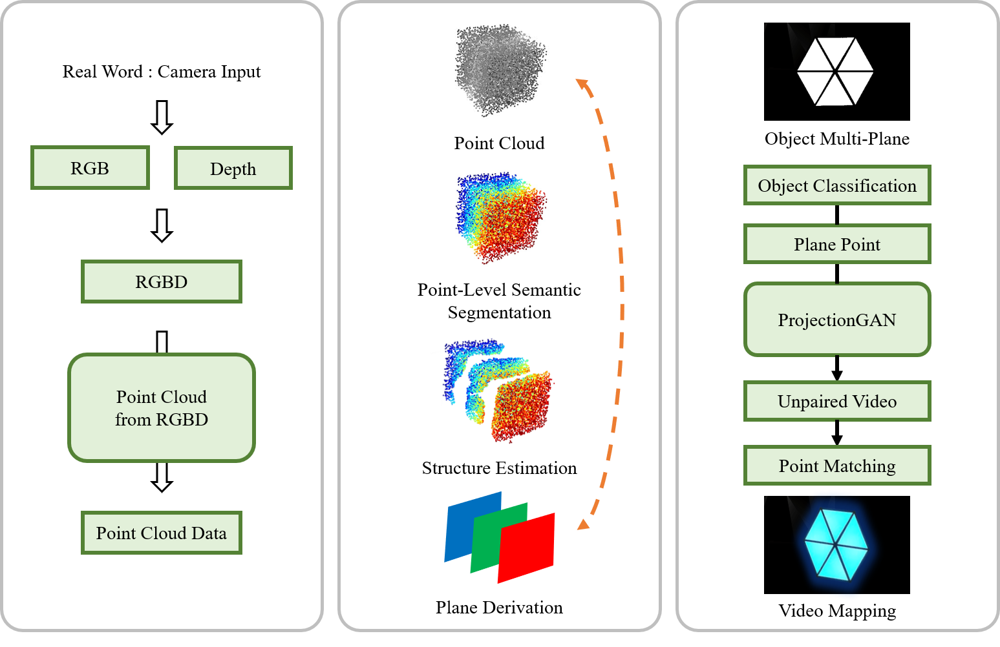

# OPMPM
OPMPM, a Object Point Matching for Projection Mapping, requiring RGB-D tags as weakly supervision.

pose estimation, point cloud semantic segmentation, plane derivation, weakly supervision, unpaired video generation.

## Implementation Environment
- Windows10
- Azure Kinect SDK
- CUDA
- Pytorch
- Python
- Open3D-ML
- OpenCV
